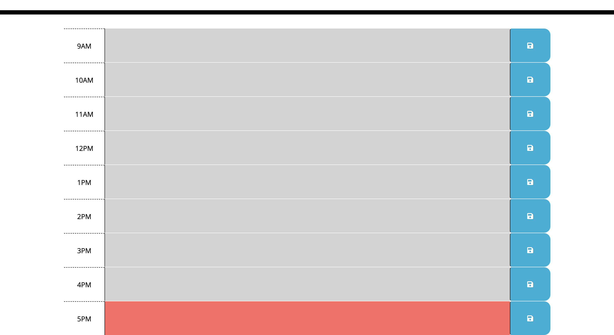
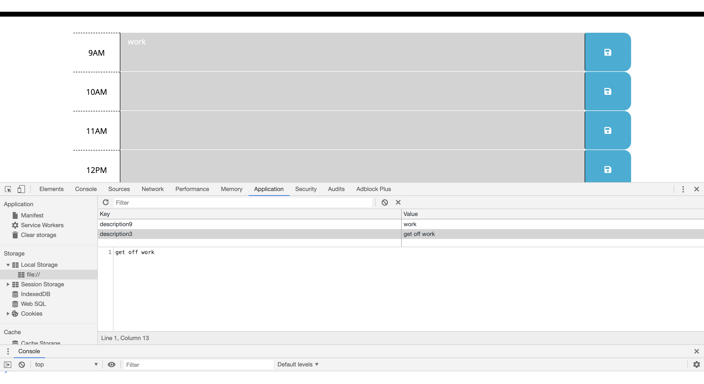

# Daily Calender Project
This is an interactive daily calender that saves the text individually in the local storage depending on the time. It is integrated to save on refresh so you don't lose your calender if you leave the webpage. 
  

##  Links
Git Pages
https://rythomas2525.github.io/calender/
Git Hub Repository
https://github.com/rythomas2525/calender

## Screenshots

## Developed by Ryan Thomas
